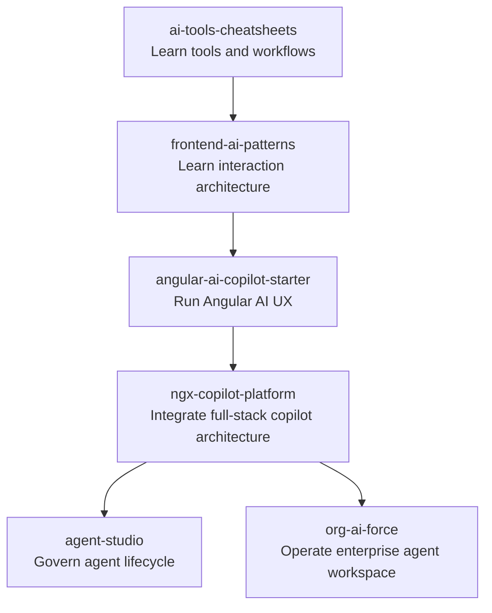

# Ecosystem Role — AI Tools Cheatsheets

`ai-tools-cheatsheets` is the **discovery and learning layer** of the AnkitParekh007 open-source AI architecture portfolio.

Its purpose is intentionally different from the application repositories: help developers understand the fast-moving AI engineering toolchain, then point readers toward deeper implementation and architecture proof.

## Portfolio funnel



## Editorial architecture

The handbook should remain organized around decisions developers actually make:

```text
Choose tool
  -> configure repository instructions
  -> connect MCP/tools safely
  -> run engineering workflow
  -> validate output
  -> adopt at team level
  -> govern permissions/cost/security
```

## Evidence standard

A handbook that covers rapidly changing tools must distinguish:

- verified official behavior
- locally tested behavior
- documentation-only verification
- account/paid-plan requirements
- experimental/deprecated/unsupported behavior
- claims that still need verification

This evidence model is part of the product quality, not editorial decoration.

## Boundaries

This repository should **not** become:

- another general AI news feed
- a duplicate of `frontend-ai-patterns`
- a monolithic application implementation
- a dump of unverified commands

Application architecture belongs in the implementation repositories; this project remains the high-quality engineering handbook and community entry point.

## Cross-links

- [`frontend-ai-patterns`](https://github.com/AnkitParekh007/frontend-ai-patterns) — trustworthy AI frontend patterns.
- [`angular-ai-copilot-starter`](https://github.com/AnkitParekh007/angular-ai-copilot-starter) — runnable Angular AI UX.
- [`ngx-copilot-platform`](https://github.com/AnkitParekh007/ngx-copilot-platform) — full-stack Angular copilot platform.
- [`agent-studio`](https://github.com/AnkitParekh007/agent-studio) — governed agent application factory.
