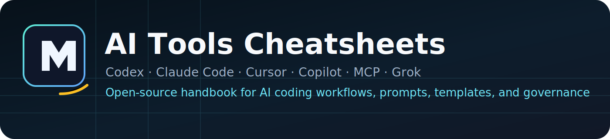

<p align="center">
  
</p>

<h3 align="center">
  One open-source handbook for Claude Code, OpenAI Codex, Cursor, Copilot, Grok, MCP, prompts, templates, and team AI coding workflows.
</h3>

<p align="center">
  <a href="https://github.com/AnkitParekh007/ai-tools-cheatsheets/stargazers">
    
  </a>
  <a href="https://github.com/AnkitParekh007/ai-tools-cheatsheets/fork">
    
  </a>
  
  
  
</p>

## What This Repository Is

This repository is a command-first handbook for modern AI coding tools, coding agents, IDE assistants, MCP-based integrations, prompts, team policies, and implementation templates.

It is intended to give engineering teams one place to:

- compare tools before standardizing
- install and configure common AI coding assistants
- choose safer workflows for review, debugging, testing, and upgrades
- evaluate MCP servers with least privilege
- copy reusable prompts, templates, and governance starters

## What This Repository Is Not

This repository is not:

- a promise that every tool or workflow has been locally tested
- a vendor marketing page
- a generic prompt dump
- a substitute for your company's security review or approval process

## Live Site

- GitHub Pages: [ankitparekh007.github.io/ai-tools-cheatsheets](https://ankitparekh007.github.io/ai-tools-cheatsheets/)
- HonKit docs source: [docs/README.md](./docs/README.md)

## Recommended Starting Pages

| Page | Why start there |
| --- | --- |
| [Quick Start](./docs/getting-started/quick-start.md) | choose a safe first workflow |
| [Choosing the Right Tool](./docs/getting-started/choosing-the-right-tool.md) | select by task, host, and risk |
| [Comparison Matrix](./docs/getting-started/comparison-matrix.md) | compare AI coding tools side by side |
| [Workflow Overview](./docs/workflows/README.md) | pick a repeatable engineering workflow |
| [MCP Overview](./docs/mcp/README.md) | understand privileged integrations before enabling them |
| [Templates Overview](./docs/templates/README.md) | copy reusable repo standards and review artifacts |

## Project Maturity

Core tool guides and config-file guidance are the most mature parts of the handbook.

Workflow, MCP, prompt, template, and governance sections are designed to be practical today, but some pages remain `Documentation verified`, `Requires account`, or `Needs verification`. Treat those labels as decision support, not proof of local execution.

## Verification Philosophy

This repository uses explicit status labels instead of implied certainty. Approved labels include:

- `Verified`
- `Locally tested`
- `Partially verified`
- `Documentation verified`
- `Not locally tested`
- `Requires account`
- `Requires paid plan`
- `Platform-specific`
- `Experimental`
- `Deprecated`
- `Unsupported`
- `Unable to verify`
- `Needs verification`

When a claim is not locally exercised, the page should say so.

## Security Disclaimer

AI coding tools and MCP servers can read repositories, run commands, open network connections, and modify code. Start with least privilege, prefer read-only trials, and require human review before merge, deployment, or credential changes.

Read [SECURITY.md](./SECURITY.md) and [Security and Permissions](./docs/governance/security-and-permissions.md) before enabling broad access.

## Quick Local Setup

```bash
npm ci
npm run docs:validate
npm run docs:serve
```

Additional commands:

```bash
npm run docs:build
npm run docs:links
npm run docs:navigation
npm run docs:metadata
npm run docs:paths
```

## Fork for Your Team

Use this repository as a baseline for an internal engineering handbook:

- replace the approved tool list
- add company-specific `AGENTS.md`, `CLAUDE.md`, and editor rules
- document approved MCP servers and revocation paths
- add internal prompts, workflows, and rollout policy
- keep external-source links while layering in internal controls

Start with [Fork for Your Team](./docs/getting-started/fork-for-your-team.md) and [Customize for Your Team](./docs/governance/customize-for-your-team.md).

## Contributing

- Contribution guide: [CONTRIBUTING.md](./CONTRIBUTING.md)
- Content standard: [CONTRIBUTING_CONTENT.md](./CONTRIBUTING_CONTENT.md)
- Launch audit: [docs/launch-readiness-audit.md](./docs/launch-readiness-audit.md)
- Content audit: [docs/content-audit.md](./docs/content-audit.md)
- Good first issues: [GitHub issue search](https://github.com/AnkitParekh007/ai-tools-cheatsheets/issues?q=is%3Aissue+is%3Aopen+label%3A%22good+first+issue%22)

## Current Priorities

- keep major tool pages current against official docs
- deepen workflow demonstrations with safer validation steps
- improve MCP evaluation coverage and least-privilege guidance
- add stronger company-fork examples for policies and templates
- keep validation automation strict and lightweight

## License

[MIT](./LICENSE)

## Acknowledgements

This handbook exists because the AI coding ecosystem is moving faster than most team documentation. The project builds on official vendor docs, protocol docs, and maintainer guidance, then organizes them into a team-usable reference.
