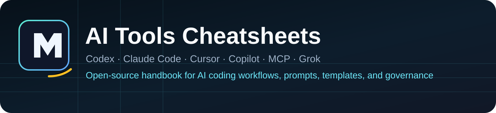

<p align="center">
  
</p>

<h2 align="center">The open-source AI coding handbook for developers and engineering teams.</h2>

<p align="center">
  Claude Code · OpenAI Codex · Cursor · GitHub Copilot · Gemini CLI · Grok · MCP · AGENTS.md · CLAUDE.md · Prompts · Workflows
</p>

<p align="center">
  <a href="https://ankitparekh007.github.io/ai-tools-cheatsheets/"><strong>Read the docs</strong></a>
  ·
  <a href="./docs/getting-started/quick-start.md"><strong>Quick start</strong></a>
  ·
  <a href="./docs/getting-started/comparison-matrix.md"><strong>Compare tools</strong></a>
  ·
  <a href="./docs/prompts/README.md"><strong>Copy prompts</strong></a>
  ·
  <a href="https://github.com/AnkitParekh007/ai-tools-cheatsheets"><strong>Star this repo</strong></a>
</p>

<p align="center">
  <a href="https://github.com/AnkitParekh007/ai-tools-cheatsheets">
    
  </a>
  <a href="https://github.com/AnkitParekh007/ai-tools-cheatsheets/fork">
    
  </a>
  
  
  
</p>

> Stop searching across dozens of AI coding docs. This repository organizes practical cheat sheets, comparisons, repo instruction files, MCP guidance, prompts, templates, security notes, and repeatable engineering workflows in one source-backed handbook.

## Start With the Most Useful Pages

| Need | Start here |
| --- | --- |
| Pick an AI coding tool | [AI Coding Tools Comparison Matrix](./docs/getting-started/comparison-matrix.md) |
| Get productive quickly | [Quick Start](./docs/getting-started/quick-start.md) |
| Learn Claude Code | [Claude Code Cheat Sheet](./docs/tools/claude-code.md) |
| Learn OpenAI Codex | [OpenAI Codex Cheat Sheet](./docs/tools/openai-codex.md) |
| Learn Cursor | [Cursor Cheat Sheet](./docs/tools/cursor.md) |
| Standardize agent instructions | [AGENTS.md](./docs/configs/agents-md.md) and [CLAUDE.md](./docs/configs/claude-md.md) |
| Connect tools safely | [MCP Overview](./docs/mcp/README.md) and [Useful MCP Servers](./docs/mcp/useful-mcp-servers.md) |
| Copy reusable prompts | [Prompt Library](./docs/prompts/README.md) and [Master Prompts](./docs/prompts/master-prompts.md) |
| Run real engineering tasks | [Workflow Library](./docs/workflows/README.md) |
| Adopt AI across a team | [For Teams](./docs/for-teams/README.md) |
| Contribute a small improvement | [Contribute in 10 Minutes](./docs/getting-started/contribute-in-10-minutes.md) |

## What You Get

- **AI coding tool cheat sheets** for Claude Code, OpenAI Codex, Cursor, GitHub Copilot, Gemini CLI, Windsurf, Cline, Roo Code, Aider, Continue, OpenCode, and Grok/xAI
- **Repo instruction guides** for `AGENTS.md`, `CLAUDE.md`, Cursor Rules, Copilot instructions, MCP configs, and editor conventions
- **Engineering workflows** for code review, bug fixing, feature development, testing, refactoring, migration, CI/CD, PR creation, release notes, and security review
- **MCP evaluation guides** for GitHub, Jira, Bitbucket, Playwright, Figma, filesystem, databases, Supabase/Postgres, Slack/Teams, and security tooling
- **Copy-ready prompts and templates** for review, testing, migration, documentation, task briefs, tool evaluation, and security checks
- **Team adoption guidance** for permissions, rollout, cost management, approved tools, prompt review, MCP approval, and internal customization

## Why This Repo Is Different

The AI coding ecosystem changes too quickly for unverified command dumps to be useful. This handbook uses explicit verification labels and source boundaries instead of pretending every workflow has been locally tested.

Approved labels include `Verified`, `Locally tested`, `Partially verified`, `Documentation verified`, `Not locally tested`, `Requires account`, `Requires paid plan`, `Platform-specific`, `Experimental`, `Deprecated`, `Unsupported`, `Unable to verify`, and `Needs verification`.

When a claim is not locally exercised, the page should say so.

## Popular Developer Paths

### Build and Debug

- [Feature Development](./docs/workflows/feature-development.md)
- [Bug Fixing](./docs/workflows/bug-fixing.md)
- [Test Generation](./docs/workflows/test-generation.md)
- [Refactoring](./docs/workflows/refactoring.md)
- [CI/CD Automation](./docs/workflows/ci-cd-automation.md)

### Review and Ship

- [Code Review](./docs/workflows/code-review.md)
- [Security Review](./docs/workflows/security-review.md)
- [PR Creation](./docs/workflows/pr-creation.md)
- [Release Notes](./docs/workflows/release-notes.md)

### Configure AI Agents

- [AGENTS.md](./docs/configs/agents-md.md)
- [CLAUDE.md](./docs/configs/claude-md.md)
- [Cursor Rules](./docs/configs/cursor-rules.md)
- [GitHub Copilot Instructions](./docs/configs/github-copilot-instructions.md)
- [MCP Configs](./docs/configs/mcp-configs.md)

## Audience Guides

- [For Developers](./docs/for-developers/README.md)
- [For Teams](./docs/for-teams/README.md)
- [For Engineering Leaders](./docs/for-engineering-leaders/README.md)
- [For Platform and Security](./docs/for-platform-and-security/README.md)

## Live Documentation

**GitHub Pages:** [ankitparekh007.github.io/ai-tools-cheatsheets](https://ankitparekh007.github.io/ai-tools-cheatsheets/)

The site includes search, dark/light themes, curated navigation, comparison pages, and source-backed reference material.

## Fork It for Your Engineering Team

Use this repository as a baseline for an internal AI engineering handbook:

- replace the approved tool list
- add company-specific `AGENTS.md`, `CLAUDE.md`, and editor rules
- document approved MCP servers and revocation paths
- add internal prompts, workflows, and rollout policy
- keep external-source links while layering in internal controls

Start with [Fork for Your Team](./docs/getting-started/fork-for-your-team.md) and [Customize for Your Team](./docs/governance/customize-for-your-team.md).

## Security First

AI coding tools and MCP servers can read repositories, run commands, open network connections, and modify code. Start with least privilege, prefer read-only trials, and require human review before merge, deployment, or credential changes.

Read [SECURITY.md](./SECURITY.md) and [Security and Permissions](./docs/governance/security-and-permissions.md) before enabling broad access.

## Contribute

A useful first PR can be a single corrected command, official source, validation step, prompt improvement, accessibility fix, or clearer example.

- [Contribute in 10 Minutes](./docs/getting-started/contribute-in-10-minutes.md)
- [Contribution Guide](./CONTRIBUTING.md)
- [Content Standard](./CONTRIBUTING_CONTENT.md)
- [Good First Issues](https://github.com/AnkitParekh007/ai-tools-cheatsheets/issues?q=is%3Aissue+is%3Aopen+label%3A%22good+first+issue%22)
- [Help Wanted](https://github.com/AnkitParekh007/ai-tools-cheatsheets/issues?q=is%3Aissue+is%3Aopen+label%3A%22help+wanted%22)

If this repository saves you time, **star it** so you can find it again and so more developers can discover it.

## Maintainer Setup

```bash
npm ci
npm run docs:validate
npm run seo:validate
npm run docs:serve
```

Additional commands:

```bash
npm run docs:build
npm run seo:sitemap
npm run docs:links
npm run docs:navigation
npm run docs:metadata
npm run docs:paths
```

## Project Maturity

Core tool guides and config-file guidance are the most mature parts of the handbook. Workflow, MCP, prompt, template, and governance sections are practical today, but some pages remain `Documentation verified`, `Requires account`, or `Needs verification`. Treat those labels as decision support, not proof of local execution.

## SEO and Discoverability

- [SEO Audit and Roadmap](./docs/seo/seo-audit.md)
- [Search Intent Map](./docs/seo/topic-map.md)
- [Measurement Plan](./docs/seo/seo-scorecard.md)
- [Social Preview Asset](./docs/assets/images/social/social-repo-preview.png)

## Growth Review Automation

- Weekly growth-review system: [growth-review/README.md](./growth-review/README.md)
- Reports and snapshot history are versioned separately from the primary docs experience

## License

[MIT](./LICENSE)

## Acknowledgements

This handbook exists because the AI coding ecosystem is moving faster than most team documentation. The project builds on official vendor docs, protocol docs, and maintainer guidance, then organizes them into a developer- and team-usable reference.
